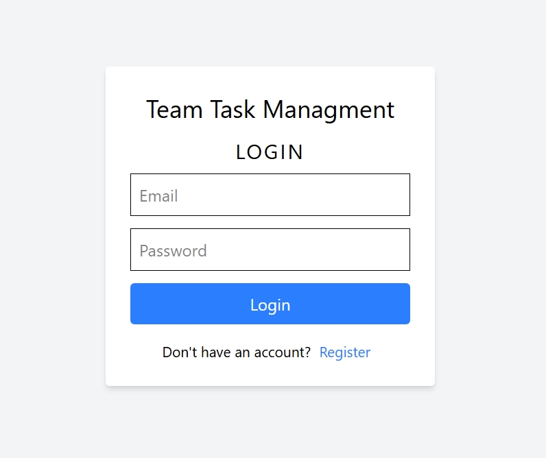
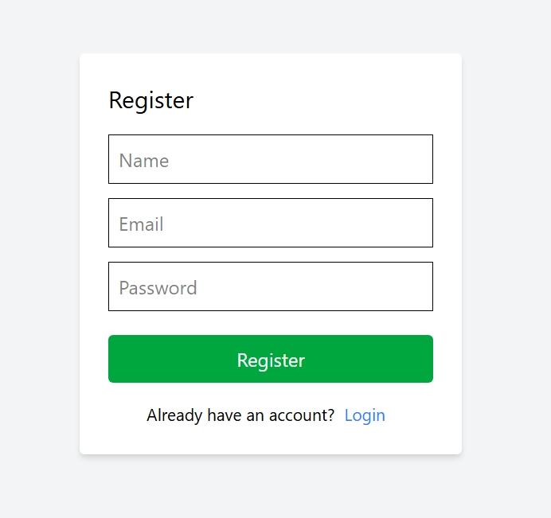
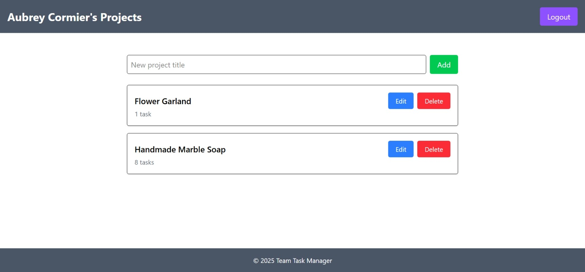
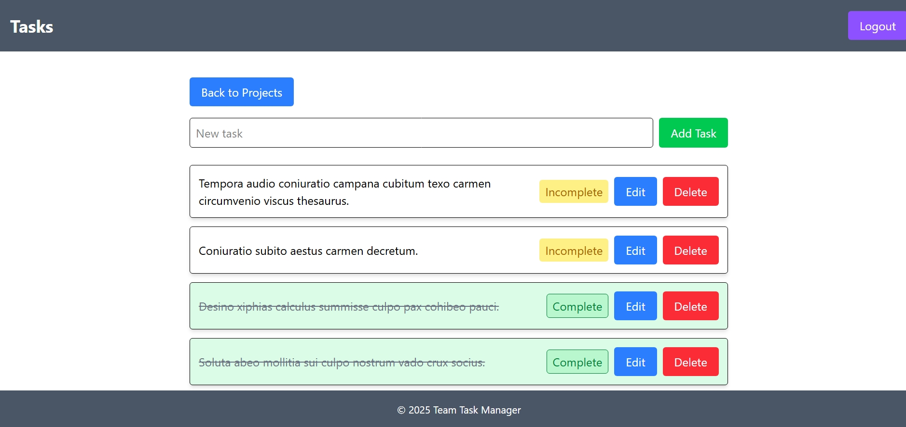
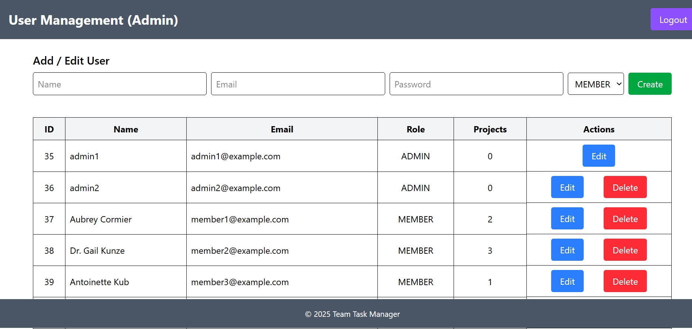
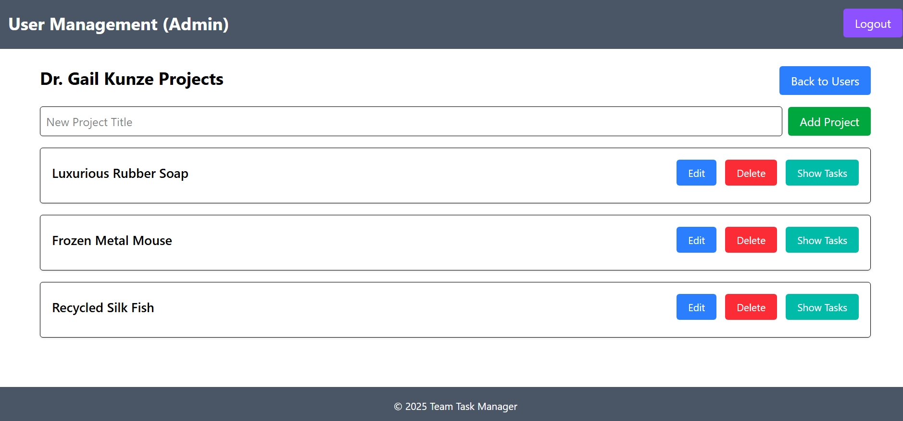
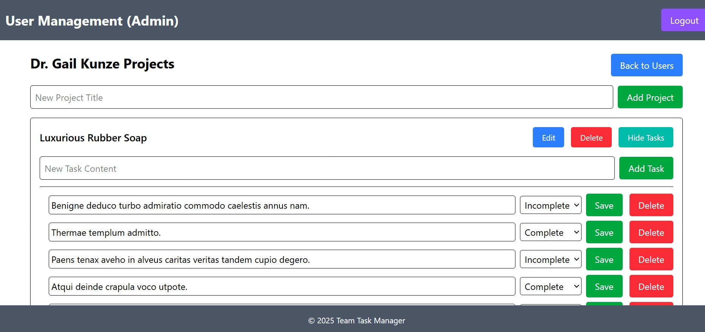

# Team Task Manager

A full-stack project task management application for teams. Built using MERN stack, it supports user authentication, project and task management, and admin-level user control.

> Admins can manage **all** users, projects, and tasks.  
> Members can only manage **their own** projects and tasks.

---

## Features

- JWT Authentication.
- Admin dashboard to manage all users.
- CRUD for:
  - Users (Admin).
  - Projects (User/Admin).
  - Tasks within projects (User/Admin).
- View tasks per project with completion status.
- Confirmation modals for deletion.
- Validations accurate and consistent data.
- Persistent using PostgreSQL + Prisma.
- Updates using React Query.
- Fully responsive Tailwind UI.

---

## Tech Stack

### Backend:

- Node.js + Express.js
- PostgreSQL + Prisma ORM
- JWT for authentication
- Role-based route protection

### Frontend:

- React.js (Vite)
- Next.js
- Zustand (Auth state)
- React Query (Data fetching & caching)
- React Router (Navigation)
- Tailwind CSS (Styling)
- Axios (API client)

---

## User Roles & Permissions

| Action                              | Admin          | Member        |
| ----------------------------------- | -------------- | ------------- |
| Register                            | ❌             | ✅            |
| Login                               | ✅             | ✅            |
| Create/Read/Update/Delete: Projects | ✅ (all users) | ✅ (own only) |
| Create/Read/Update/Delete: Tasks    | ✅ (all users) | ✅ (own only) |
| Manage Users (CRUD)                 | ✅             | ❌            |

---

## Screenshots









---

## Getting Started

### Clone the repo

```
git clone https://github.com/rehman308/team-task-manager.git
cd team-task-manager
```

### Setup Backend

```
cd backend
npm install
```

Update `.env` with your PostgreSQL URL (database name and password) and JWT secret. See `.env.example`

### Seed Database (Optional)

```
node prisma/seed.js
```

### Start Server

```
npx prisma migrate dev --name init
npm run dev
```

### Setup Frontend

```
cd frontend
npm install
npm run dev
```

The frontend will be available at: http://localhost:5173

---

## Default Users (from seed)

| Role   | Email               | Password  |
| ------ | ------------------- | --------- |
| Admin  | admin1@example.com  | admin123  |
| Member | member1@example.com | member123 |

---

## sds

```
Team Task Manager/
├── backend/
│   ├── prisma/
│   └── src/
│       ├── controllers/
│       ├── routes/
│       ├── middleware/
│       └── index.js
└── frontend/
	    ├── api/
      ├── app/
          ├── admin/
          ├── login/
          ├── projects/
          └── register/
	    ├── auth/
	    ├── components/
	    └── hooks/
```

## API Endpoints

### Authentication

| Method | Endpoint           | Description         | Auth   |
| ------ | ------------------ | ------------------- | ------ |
| POST   | /api/auth/register | Register new member | Public |
| POST   | /api/auth/login    | Login               | Public |

---

### Projects

| Method | Endpoint          | Description    | Auth      |
| ------ | ----------------- | -------------- | --------- |
| GET    | /api/projects     | List projects  | Protected |
| POST   | /api/projects     | Create project | Protected |
| PUT    | /api/projects/:id | Update project | Protected |
| DELETE | /api/projects/:id | Delete project | Protected |

---

### Tasks

| Method | Endpoint                      | Description           | Auth      |
| ------ | ----------------------------- | --------------------- | --------- |
| GET    | /api/tasks/project/:projectId | List tasks in project | Protected |
| POST   | /api/tasks/project/:projectId | Add task to project   | Protected |
| PUT    | /api/tasks/:id                | Update task           | Protected |
| DELETE | /api/tasks/:id                | Delete task           | Protected |

---

### Users (Admin Only)

| Method | Endpoint                | Description       | Auth  |
| ------ | ----------------------- | ----------------- | ----- |
| GET    | /api/users              | List users        | Admin |
| POST   | /api/users              | Create user       | Admin |
| PUT    | /api/users/:id          | Update user       | Admin |
| DELETE | /api/users/:id          | Delete user       | Admin |
| GET    | /api/users/:id/projects | Get user projects | Admin |
| GET    | /api/users/:id/name     | Get user name     | Admin |

---

## License

MIT License. Feel free to use and modify for your own projects. Please remember to give proper credit.
